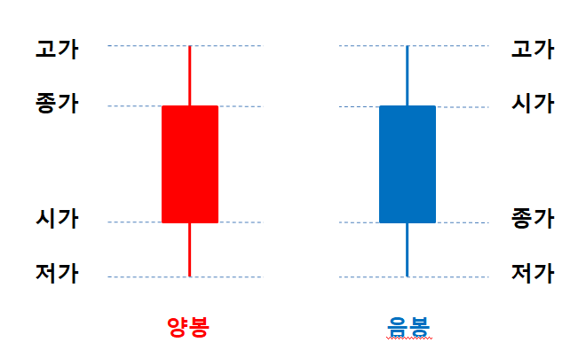

# chart

## 👀 증권차트 : 봉차트 (= 캔들차트)

* 양봉(빨간색) : 장이 시작할 때 가격보다 장 마감 때 가격이 _올라간_ 경우
    * `고가` : 그 날 하루에 최대로 올라간 위치
    * `종가` : 장이 끝날 때, 마지막으로 체결된 가격
    * `시가` : 장이 시작할 때, 최초로 체결된 가격
    * `저가` : 그 날 하루에 최대로 내려간 위치

* 음봉(파란색) : 장이 시작할 떄 가격보다 장 마감 때 가격이 _내려간_ 경우

## 👀 증권차트 : 이동평균선

* 봉차트 말고 선으로 보이는 그래프
* 일주일 간의 평균값을 선으로 표시한 것 (봉차트만 보면 상승인지 하강인지 보여주기 위함)
* 지지선, 저항선
* `저항선을 뚫었다.`
* `지지선을 이탈했다.`

## 패턴
    * 헤드 앤 숄더 패턴
        * 머리 어깨 모양
        * 상승하다가 빠지는 것, 

  

## 👂🏻 차트를 너무 맹신하지 말 것.

## reference
* [주식 초보라면 꼭 알아둬야 할 차트보는 방법](https://www.youtube.com/watch?v=hI3pzjLbOzY&ab_channel=14F%EC%9D%BC%EC%82%AC%EC%97%90%ED%94%84)