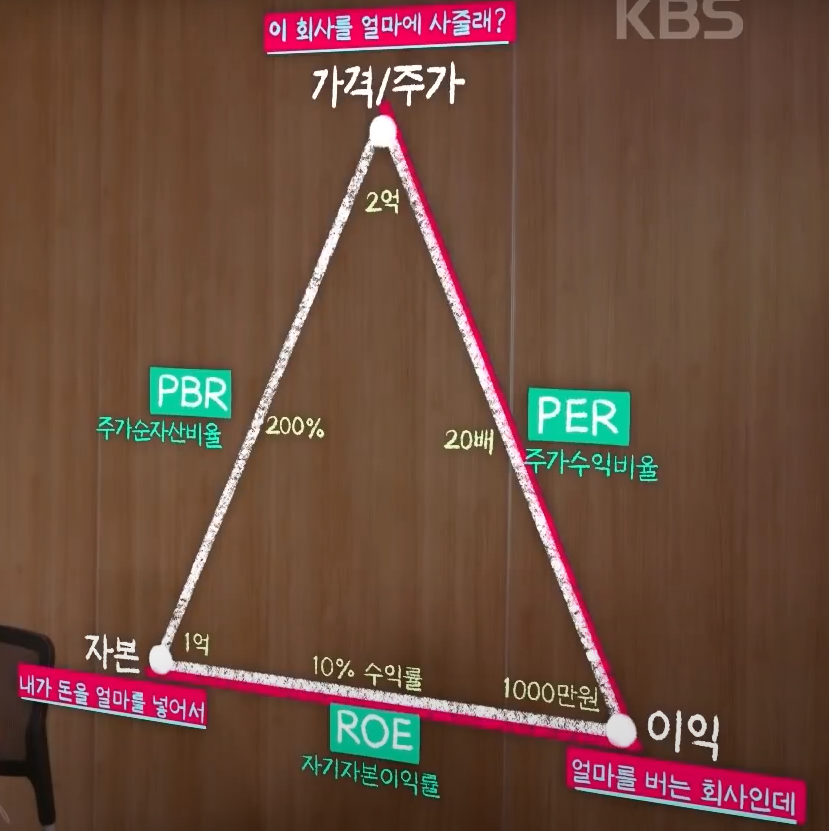

# concept
주식을 시작하기 위한 기본적인 개념들

# 기본개념 index 🌸
* [주식회사](#1)
* [상장](#2)
* [주식시장](#3)
* [주식시장 시간 : 주식 장](#3-1)
* [주식시장에서 거래하는 사람](#3-2)
* [액면가 vs 공모가 vs 주가 vs 자본금](#4)
* [시가총액](#4-1)
* [채권 vs 주식](#5)
* [지분](#6)

# 주식시작 index 🌸
* [주식을 시작하려면](#a-1)
* [주식을 사기 위해서 고려할 것](#b-1)
* [거래량](#c-1)
* [조정기간](#c-2)
* [동시호가](#c-3)
* [예수금 vs 증거금 vs 반대매매](#d-1)
* [보통주 vs 우선주 vs 배당금](#d-2)
* [ROE vs PBR vs PER](#d-3)

## 주식회사
자본금을 투자받아서, 주식으로 발행하여 운영되는 회사

##  상장
* 회사가 더욱 더 잘되었을 시, 주식시장에 `나` 를 공개하는 것
* 결과적으로 기업의 주식을 거래할 수 있도록 하기위해 일정한 조건을 갖춰 증권 거래소에 등록하는 일을 뜻한다.

##  주식시장
* 주식을 사고 파는 곳
* 주식시작은 아래와 같이 존재한다.
    * `코스피 (KOSPI)`
    * `코스닥 (KOSDAQ)`
    * 코넥스
    * K-OTC  
* `각 시장마다 상장을 할 수 있는 조건이 다르다.`
    * 코스피 (KOSPI)
        * 한국증권거래소에 상장되어 거래되는 모든 주식의 시가총액을 합쳐서 주식시장 전체 장세의 흐름을 나타내는 지수이다. 1980년 1월 4일 기준 상장종목 전체의 시가총액을 100으로 보고 현재 상장종목들의 시가총액이 어느 수준에 놓여있는지 쉽게 확인할 수 있다.
        * `KOSPI 지수 = (현재 시가총액 합 / 1980.1.4 기준 시가총액 합) * 100`
        * 회사의 자본금이 300억 이상
        * 최근 매출액 1000억 이상
        * 3년 평균 매출액 700억 이상
        * `규모가 큰 회사들`
    * 코스닥 (KOSDAQ)
        * 벤처기업 기준 (일반기업 기준)
        * 자기자본금 15억 이상 (30억 이상)
        * 당기순이익 10억 이상 (20억 이상)
        * `규모가 작은 회사들`

##  주식시장 시간 : 주식 장
* 정규시장 개장
    * `09:00 ~ 15:30`
* 장전 시간 외 거래
    * `08:30 ~ 08:40`
* 장외시장
    * `15:40 ~ 16:00`

##  주식시장에서 거래하는 사람
* 개인투자자 (= 개미)
* 기관
    * 일반인들에게 돈을 모아서 대신 투자함
    * 국민연금, 보험사, 증권사, 은행 등
        * 훨씬 큰 돈으로 주식을 사고 판다.
* 외국인
* 수급의 주체를 확인한다.
    * 수급의 주체가 살 때 같이 사고, 팔 때 같이 판다.
    * 각 주체별 수급을 확인하는 것이 중요하다.

##  액면가 vs 공모가 vs 주가 vs 자본금
* `액면가`
    * 주식에는 액면이 배정된 금액이 존재
    * 주식회사가 최초로 주식을 발행할 때, 1주당 가격을 의미
    * 일반적으로 `액면가 100원인 주식` 또는 `액면가가 500원인 주식` 이라고 표현
    * `최초 주식 발생 시, 1주당 가격` 을 의미
* `공모가`
    * 주식이 주식시장에 최초로 상장될 때 가격
    * 일반적으로 액면가보단 높은 금액으로 책정
    * 주식시장에서 `수요` 가 증가하면 공모가에서 올라가면서 주가가 올라갓 것
    * 부동산에서의 분양가 (처음) 및 매매가 (판매) 를 생각하면 된다.
* `주가` 
    * `주식의 시장 가격`
* `자본금`
    * 주식수 * 액면가 = 자본금

##  시가총액
* `시가총액` = 주가 * 주식수
* 1개 국가의 `시가총액` = 상장된 모든 기업의 시가총액의 합

##  채권 vs 주식
* 주식
    * 회사가 돈을 투자받음
* 채권
    * 회사가 돈을 빌리고 갚음
* 주식투자자 vs 채권투자자
    * __경기가 호황이라면?__ `주식투자자` 가 좋다.
        * 회사가 돈 잘 벌고, 기업가치 상승 및 주식가격 상승
    * __경기가 불황이라면?__ `채권투자자` 가 좋다.
        * 회사가 망하지 않으면 채권만기일에 원금 + 이자를 받아가게 된다.

##  지분
* 특정 A 회사의 자본금이 100만원이고 액면가가 100원이다. 그리고 나의 주식이 100주라고 한다면, 현재 나의 지분은 `100%` 라고 할 수 있다.
    * `100주 * 100원 = 100만원` 이기 때문
* 주식을 살 때, 의결권(의사결정권) 이 따라온다.
    * 주식을, 즉 지분을 많이 갖고 있는 사람이 의결권이 크다.

##  주식을 시작하려면
* 주식거래를 위한 증권계좌가 필요
* 증권회사에서 주식거래 계좌를 구매
* 주식거래 시에 수수료가 붙는데, `수수료를 작게 받는 증권사` 를 선택한다.

##  주식을 사기위해서 고려할 것
* `탑다운`
    * `연말` 에 경제전망을 살펴본다.
    * 지금 시장에 투자하기 알맞는지
    * 산업군 (=종목) 을 찾는다.
        * 산업군 내에서도 어떤 회사가 가장 잘 나가는지 확인이 필요
        * 종목을 고르기 위해선 아래의 내용을 살펴본다. 😮
            * 재무재표
* `바텀업`
    * `회사` 를 보고 구매한다.

##  거래량
`증권시장에서 매매거래가 성립된 수량` 인데, 좀 더 풀어서 말하면 주식(증권)시장에서 매수자와 매도자의 거래로 인해서 체결된 매수량과 매도량의 양을 의미한다. A 라는 인물이 `1주를 매도` 하고, B 라는 인물이 `1주를 매수` 해야 `거래량 1주` 가 성립된다.

* 거래량이 크게 증가하면 주가는 상승한다.
* 거래량이 급증한 후 횡보하는 종목을 눈여겨 보라
    * `횡보`란, 모양이나 태도가 변화없이 일관성되게 유지되는 상태를 의미한다.
    
##  조정기간
특정 종목에 대한 주식이 가격 상승을 하는 추세를 보이다가 이후에 주가 상승의 모습을 보이지 않는 경우가 있다. `주식 조정` 이란 일정 기간 동안 주식 가격 상승에 대한 부담을 해소하는 과정으로써 일정한 가격 제한폭을 가지고 주식 가격이 조정되는 것을 뜻한다. 

상승폭이 컸던 종목에 대한 `차익욕구` 가 커지면서 주가는 일정한 범위 내에서 하락하는 모습을 보인다. 여기서 일정한 범위 내에서 하락을 한다는 것은 주식조정의 대표적인 특징이라고 볼 수 있다.

##  동시호가
* 일반 주식 장 시간에는 실시간으로 거래가 이루어진다.
* 하지만 아래의 시간대에는 `실시간 거래가 이루어지지 않는다.`
    * 장전 동시호가 : `08:30 ~ 09:00` 
    * 장후 동시호가 : `15:20 ~ 15:30`
* `정해진 시간동안 주문을 받은 다음, 동시호가 시간이 끝나면 동시에 처리하는 개념` 이다.

##  예수금 vs 증거금 vs 반대매매
* `예수금`
    * `증권계좌에 입금되어 있는 금액`을 의미, 매매 결제 대금으로 사용하지 않은 금액을 의미한다. (매매결제대금 : 매매 거래에 든 비용)
    * 만약 1000만원의 현금 중에서 400만원을 주식매매로 결제했다면 나머지 600만원의 현금을 예수금이라고 하는 것이다.
* `증거금`
    * 증권시장에서 고객이 주식을 매매할 경우, 약정대금의 일정비율에 해당하는 금액을 예탁(미리 부탁하는) 해야 하는 일종의 보증금이다. (주식 구매 전 일종의 계약금)
    * 주식거래는 `3일 결제` 시스템이기 때문에 증거금 40% 짜리 주식을 100만원어치 매수한다면 매수금액의 40%인 40만원만 당일날 출금된다. 이후에 나머지 60만원은 3일째 되는날 빠져나가게 된다.
* `반대매매`
    * 특정 종목에 대한 주가가 현재 10만원이라고 하였을 때, 증거금이 20% 이다. 이 때 2만원만 있으면 `1주`를 주문이 가능한 상태이다. 이후에 D+2 되는 날 8만원(미수금) 이 증권계좌에 없으면 증권사는 미수금액만큼 강제로 처분을 하게되는데, 이를 `반대매매`라고 한다.
    * 이 때에는 시세에 상관없이 `시장가로 매도하기 때문에` 손실을 볼 수 있다.

##  보통주 vs 우선주  vs 배당금
* 우선주와 보통주의 대표적인 예시가 삼성전자와 삼성전자우(삼성전자 우선주) 가 있다.
* 보통주 
    * 기본적인 주식의 형태로 특별한 권리 내용이 정해지지 않은 `일반적인 주식` 을 의미한다.
    * 의결권을 가질 수 있어서 `주주총회` 에서 의사결정에 참여할 수 있는 권리가 있다. 1주당 1의결권을 가질 수 있다.
* 우선주
    * 의결권 (의사결정권) 이 없는 대신에 보통주보다 먼저 배당을 받을 수 있는 권리가 부여된 주식을 의미한다.
* 배당금
    * 회사의 연말결산을 통해 회사의 실적에 따라 주주들에게 `실적을 나누어주는 것` 이다.
    * 일반적으로 순이익이 많은 기업일수록 배당금을 많이 주고, 회사의 빚이 많을 수록 배당금이 전혀 없는 경우도 있다. 결과적으로 배당을 한다는 것은 `기업이 열심히 일을 하고 있다는 증거` 
* `배당금을 받기위해선` 주식이 폐장하기 전에 주식을 매수하여야 한다. 한국은 주식이 12월 31일에 폐장을 하기 때문에 12월 30일까지 주식거래가 가능하다. 즉 `12월 30일` 에 `주주명부` 에 올라가야 한다.

##  ROE vs PBR vs PER
한가지 예를 들자. 자본 1억을 들여서 슈퍼마켓을 만들었다. 슈퍼마켓은 연 1000만원의 수익률을 냈다. 그러면 슈퍼마켓의 수익률은 얼마인가? `10%` 이다. 자본금으로 슈퍼마켓을 만들었는데, 해당 슈퍼마켓의 시가총액은 2억이다. 여기서 들어간 금액 대비 시가총액은 `200%` 올랐다. 1000만원의 이익을 내고 시가총액은 2억이다. 그럼 이익 대비 시가총액은 `20배` 올랐다.
* ROE (자기 자본 이익률)
    * 수익률 10%의 `10%` 이다.
* PBR (주가 순 자산 비율)
    * 자본 대비 올라간 시가총액은 `200%` 이다.
* PER (주가 수익 비율)
    * 이익 대비 시가 총액은 `20배` 이다.
    * 특정 기업에 대한 주식 시장의 `대표적인 평가 기준`
    * PER 이 낮은 주식은 앞으로 가격 상승성이 크다고 인식할 수 있다.

## reference
* [주식을 하려면 꼭 알고 있어야 할 기본 지식 | 주식초보 입문서](https://www.youtube.com/watch?v=LzXzHoXO5ZE&ab_channel=14F%EC%9D%BC%EC%82%AC%EC%97%90%ED%94%84)
* [주식 기초 2탄 | 주식은 언제, 어떻게, 무슨 종목을 사야할까?](https://www.youtube.com/watch?v=-d291restec&ab_channel=14F%EC%9D%BC%EC%82%AC%EC%97%90%ED%94%84)
* [읽기만 하면 주식 완전정복](https://brunch.co.kr/brunchbook/stockbeginner)